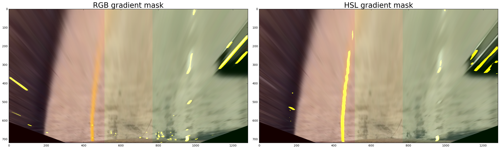
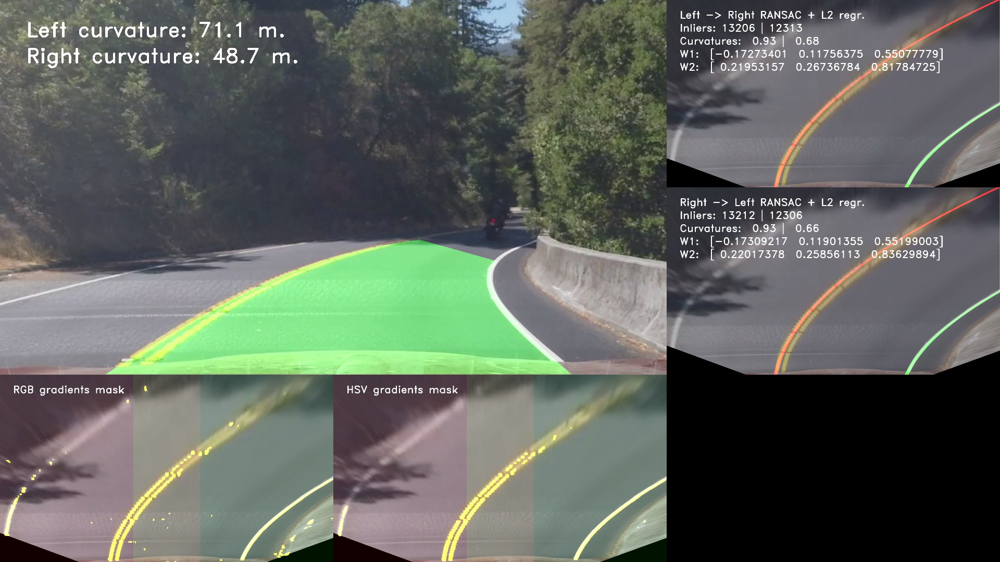

# Advanced Lane Finding Project

Let's start by recalling the main goals of this project:

* Compute the camera calibration matrix and distortion coefficients given a set of chessboard images.
* Apply the distortion correction to the raw image.
* Use color transforms, gradients, etc., to create a thresholded binary image.
* Apply a perspective transform to rectify binary image ("birds-eye view").
* Detect lane pixels and fit to find lane boundary.
* Determine curvature of the lane and vehicle position with respect to center.
* Warp the detected lane boundaries back onto the original image.
* Output visual display of the lane boundaries and numerical estimation of lane curvature and vehicle position.

---

## Project organization

Here are the main files which constitute the project:
* `advanced-lane-finding.ipynb`: Notebook containing a step by step presentation of the pipeline and the main routines to process images and videos;
* `lane_finding.py`: Python source containing numerous simple routines for drawing lanes - masks, plotting images and computing gradient masks;
* `lane_simple_ransac.py`: Implementation and customization of the algorithm RANSAC to tackle the lanes finding problem.

Note the two remaining python files `lane_ridge.py` and `lane_double_ransac.py` contain alternative implementations of linear regression algorithms (RANSAC and L2-Ridge regression) which, even though working fine, do not perform as well the former.

## Pipeline steps

The pipeline consists of three main steps: un-distorting the image, computing edges masks and performing lanes regression on the bird-view image.

### Calibration

The calibration procedure of the camera is completely standard, following the steps and advices given in the Udacity class on the subject. The main calibration routine is `calibration_parameters` in `lane_finding.py`: it opens the collection of calibration images, find the chessboard on them and record the coordinates. The latter are then used to compute the calibration transform.

```python
def calibration_parameters(path, cshape):
    # Object / image points collections.
    objpoints = []
    imgpoints = []
    # Calibration points from images.
    filenames = os.listdir(path)
    for fname in filenames:
        img = cv2.imread(path + fname)
        gray = cv2.cvtColor(img, cv2.COLOR_BGR2GRAY)
        # Theoretical Grid.
        objp = np.zeros((cshape[0] * cshape[1], 3), np.float32)
        objp[:, :2] = np.mgrid[0:cshape[0], 0:cshape[1]].T.reshape(-1, 2)
        # Corners in the image.
        ret, corners = cv2.findChessboardCorners(gray, cshape, None)
        if ret:
            objpoints.append(objp)
            imgpoints.append(corners)
        else:
            print('Warning! Not chessboard found in image', fname)
    # Calibration from image points.
    ret, mtx, dist, rvecs, tvecs = cv2.calibrateCamera(objpoints, imgpoints, img.shape[0:2], None, None)
```

The returned parameters are then used on every image / frame to un-distort them.

### Edges masks

Obtaining good quality edges masks is a key step to perform an accurate lane detection. For that purpose, we used a rather simple, but nevertheless quite robust approach: we start by computing x-gradients on two color components: grayscale and saturation. As observed in the class, and on the test images, they usually provide complimentary information about lane edges, hence motivating the use of both. Nevertheless, as seen in Project 1, edges can be quite noisy, especially when changing shade appears in the image.

Therefore, in order to improve over this simple gradient computation, we used a simple observation on lanes: there are constituted of two parallel edges (usually spaced by around 30 pixels) whose gradients are of opposite signs. This simple fact can be used to filter out numerous false positives, and only keep edges which verify this very specific property. Namely, this check is performed in the following function:
```python
def mask_local_crossing_x(gray, threshold=20, dilate_kernel=(2, 6), iterations=3):
    # Increasing mask.
    mask_neg = (gray < -threshold).astype(np.float32)
    mask_pos = (gray > threshold).astype(np.float32)

    mid = dilate_kernel[1] // 2
    # Dilate mask to the left.
    kernel = np.ones(dilate_kernel, np.uint8)
    kernel[:, 0:mid] = 0
    dmask_neg = cv2.dilate(mask_neg, kernel, iterations=iterations) > 0.
    # Dilate mask to the right.
    kernel = np.ones(dilate_kernel, np.uint8)
    kernel[:, mid:] = 0
    dmask_pos = cv2.dilate(mask_pos, kernel, iterations=iterations) > 0.
    dmask = (dmask_pos * dmask_neg).astype(np.uint8)
    return dmask
```
The previous method dilates asymmetrically positive and negative gradients (to left for negative, to the right for positive), and then compute the intersection of two previous masks. This simple algorithm ensures that objects in these masks have a lane-type shape (two edges of opposite gradient signs).

As a results, we obtain the following masks from grayscale and saturation components:


Even though the detection is not perfect (some components on the left and right sides are also being highlighted), the main part of the lanes are well detected. In addition, the previous example clearly shows that grayscale and saturation components are complementary in the detection process.

### Lane regression

The most complex part of my pipeline is the regression of the left and right lanes themselves. The Udacity class provides a simple method based on detection of histogram pics which is performing well enough in a little noise situation, but starts to get tricky if the edge input is not so clean. Similarly, a simple linear regression is useless in this situation, as any existing noise leads to a middle-type solution which is non-optimal.

As a consequence, I adopted another method from robust statistics called the RANSAC algorithm. Shortly, the idea is to randomly pick a few points in the dataset, fit a curve (line or polynomial) to these and count the total number of points in the dataset well-fitting this prediction, up to a given error margin. Then, after iterating over enough subsets of points, we keep the regression parameters which fit the maximum number of points (called insiders). The algorithm is depicted in the simple case below:


This method is widely used in applied statistics as it is quite robust to noise, and still relatively simple to implement and run. In addition, we clearly see that it fits well our lane finding problem.

A simple and direct application of this RANSAC algorithm would have been to segment independently left and right lanes, roughly dividing for that purpose the edges masks in left and right parts. This method works well in most cases, but unfortunately tends to fail when the edges detection is not optimal (for instance, under the bridge in the challenge video). The main drawback is that it does not enforce the two fitted lanes to be parallel, thus leading sometimes to absurd segmentation.

Hence, in order to obtain a better segmentation, we use a custom two stages RANSAC algorithm:
* start by detecting the left lane, with a simple RANSAC run;
* detect the right lane using a modified RANSAC algorithm which rejects lanes not parallel to the left lane (with a given margin).

The same algorithm is also applied after reversing left and right roles. From the two solutions, we keep the one which fits the maximum number of points in the edges masks.

This solution relies on a simple assumption: from the two lanes, at least one will be easily segmented by the RANSAC algorithm from edges masks. Then, the second one can be deduced, using edges but also the knowledge of the former. A typical example of such a situation is under the bridge on the challenge video, where the right lane is still quite easily segmented, and then helps to guess the position of the left one.

This custom RANSAC algorithm is fully implemented in the `lane_simple_ransac.py` source file. Note that our implementation makes heavy use of the [Numba](http://numba.pydata.org/) python JIT compiler which helps to greatly improve the speed of purely Numpy routines.

We summarize the full pipeline in the following image, displaying the final result as well as the edges masks and the two RANSAC segmentation.



The three `debug` videos also present this full pipeline.

### Video pipeline speed-up

We have described above the pipeline on a single image. When applied to a full video, the former can be optimized to run faster and take advantage of the previous frames segmentation. Namely, we added the following steps to the previous pipeline:
* compute a simple weighted linear regression (also called m-estimator in statistics) using coefficients from the previous frame. Namely, we assign weights to the masks points proportionally to the distance from the lanes of the previous frame, and then compute a linear regression which correct the small variations appearing in the new frame;
* reduce the number of iterations in the RANSAC algorithm once 10 frames have been fitted  in order to speed up the computation of every frame;
* select the best fit from the weighted linear regression, and the two RANSAC regressions described in the previous section.
* smooth the regression coefficients using a simple low-pass filter.

The main ideas behind the previous modifications are the following:
* most of the time, the lanes can be easily deduced from the previous frame by doing a simple weighted linear regression which corrects very well small lanes variations from one frame to another;
* in the case of very steep turns or more noisy edges detection, the previous iteration and correction method may deviate from the optimal solution after a few frames. Hence, we keep computing the usual RANSAC estimates in order to put the algorithm back on tracks in these cases.

This full video pipeline is illustrated in the `debug` videos, which show the three different fits.

## Performance and improvements

The pipeline performs well on first two videos, providing a smooth and accurate segmentation of the lane, but still adapting quickly to small variations due to road bumps. In addition, the challenge video, it performs well under the bridge, being able to well segment the lane despite noisy edges inputs. It also manages to filter out wrong edges coming from road construction defaults, and only keeping relevant edges.

The performance on the third very challenging video is clearly not as good. The algorithm still manages to segment the road on a large part of the video, despite difficult light and shade conditions and quite steep turns. Nevertheless, it also gets lost on a few occasions, in particular when the right lanes is hardly visible (under leaves, or just not on the video!).

I believe this non-optimal performance could be fixed by improving several aspect of the pipeline:
* edges detection: the latter remains quite noisy on the last video, and I think could be improved significantly. One way to do so could be to compute the skelelon on edges masks, and then remove small noisy components, keeping only long lines. It would help the RANSAC algorithm by removing quite a lot of noisy points, and also speed up computation by reducing the number of points to iterate on;
* the RANSAC algorithm could be implemented on GPU: the main operations can be easily parallelized, and such an implementation would massively speed up the process. With current parameters, it takes around 0.1 second to run the former, and I guess a GPU implementation would be faster by several factors;
* edges masks could also be directly computed on GPUs, since it only consists of simple filter convolutions; 
* as shown in the debug videos, adjacent lanes could also be determined. The previous pipeline can be easily adapted to this setting, and I think that such a computation could also make the overall segmentation process more robust to noise.

Of course, a complete different approach is possible using convolutional neural networks. The recent literature on lanes detections tends to go in this direction as it happens to be more robust to noise and allows to optimise the full pipeline instead of every brick inside.